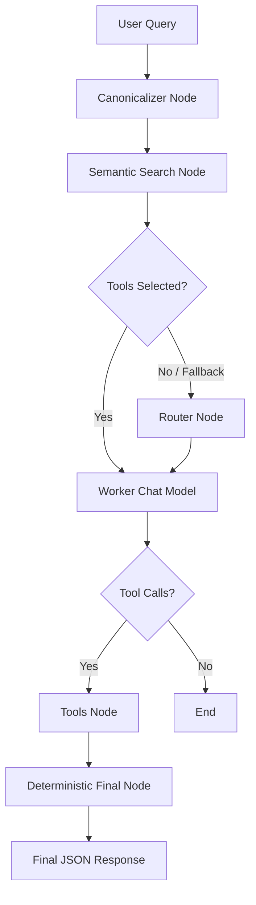

# CHAPTER1-ASSIST

CHAPTER1-ASSIST is an AI-powered ERP/accounting assistant built with **FastAPI**, **LangGraph**, **LangChain**, **Ollama**, and **ChromaDB**.

The project is designed to answer natural-language ERP queries by selecting the correct business tool, calling Chapter1 ERP APIs, filtering/projecting records, and returning a clean deterministic JSON response.

It supports queries around:

- Sales invoices
- Purchase invoices
- Customer/vendor bills
- Product and inventory details
- HSN, GST, SKU, and stock quantity
- Outstanding amount and invoice status
- Multi-intent queries in English, Hindi, Hinglish, Gujarati, or mixed language

---

## Features

- **FastAPI backend** with `/chat` endpoint
- **LangGraph workflow** for structured agent execution
- **Canonicalizer node** to normalize multilingual ERP queries into English
- **Semantic tool retrieval** using Chroma vector search
- **Metadata-based tool selection** for faster and more reliable routing
- **Router LLM** for tool selection fallback
- **Worker LLM** for actual tool-calling
- **ERP API tools** for sales, purchase, and product data
- **Dynamic filters and fields projection**
- **Deterministic final JSON builder** instead of relying on a second LLM response
- **Step timing logs** for debugging latency
- **Ollama local model support**

---

## Tech Stack

| Layer | Technology |
|---|---|
| Backend API | FastAPI |
| Agent Framework | LangGraph |
| LLM Orchestration | LangChain |
| Local LLM Runtime | Ollama |
| Vector Store | ChromaDB |
| Embeddings | Ollama Embeddings |
| Data Source | Chapter1 ERP APIs |
| Language | Python |

---

## Project Architecture



---

## How It Works

### 1. Canonicalizer Node

The canonicalizer converts mixed-language ERP queries into simple canonical English.

Example:

```text
A/0326/C0077 sales bill ka customer name, amount aur status batao
```

Becomes:

```text
Show customer name, net amount and status for sales invoice A/0326/C0077
```

It also detects document type, such as:

- `sales_invoice`
- `purchase_invoice`
- `product`
- `mixed`
- `unknown_invoice`

---

### 2. Semantic Search / Tool Selection

The system selects tools using:

1. Metadata rules from the tool registry
2. Query part splitting for multi-intent queries
3. Vector search fallback using ChromaDB

Supported tools include:

| Tool | Purpose |
|---|---|
| `get_sales_list` | Fetch sales invoice/customer bill data |
| `get_purchase_list` | Fetch purchase invoice/vendor bill data |
| `get_product_list` | Fetch product, inventory, stock, HSN, SKU, and GST data |

---

### 3. Worker LLM

The worker model does not generate the final answer directly.

Its job is to call the correct bound tools with proper arguments such as:

- `term`
- `filters`
- `fields`
- `page`
- `limit`
- `from_date`
- `to_date`

---

### 4. ERP API Tools

The API tools call Chapter1 ERP endpoints such as:

- `/salesList`
- `/purchaseList`
- `/productList`

Each tool supports:

- Pagination
- Search term
- Ledger ID
- Date range
- Dynamic field projection
- Dynamic filtering

Example filter logic:

```json
{
  "invoiceNo": "PR-31"
}
```

Example numeric filter:

```json
{
  "closingQty": {
    "lt": 0
  }
}
```

---

### 5. Deterministic Final Response

Instead of asking the LLM to generate the final answer, the project uses Python logic to merge tool outputs and return strict JSON.

This improves:

- Accuracy
- Consistency
- Debuggability
- Reduced hallucination risk

---

## Folder Structure

```text
CHAPTER1-ASSIST/
│
├── fast_main.py          # FastAPI app and /chat endpoint
├── main.py               # Local graph testing script
├── requirements.txt      # Python dependencies
├── models.txt            # Model testing notes
│
├── src/
│   ├── api_client.py     # Chapter1 API request helper
│   ├── config.py         # LLM, embeddings, and environment config
│   ├── dummy.py          # Local dummy ERP data for testing
│   ├── graph.py          # LangGraph graph builder
│   ├── nodes.py          # Canonicalizer, semantic search, worker, router, final node
│   ├── retriever.py      # Chroma vector retrieval logic
│   ├── schema.py         # LangGraph state schemas
│   ├── tool_doc.py       # Tool documents and metadata registry
│   ├── tools.py          # Dummy/local tools
│   ├── tools_api.py      # Real ERP API tools
│   └── vector_store.py   # Chroma vector store creation
│
└── chroma_db/            # Generated Chroma vector database
```

---

## Installation

### 1. Clone the Repository

```bash
git clone https://github.com/<your-username>/CHAPTER1-ASSIST.git
cd CHAPTER1-ASSIST
```

---

### 2. Create a Virtual Environment

```bash
python3 -m venv venv
source venv/bin/activate
```

On Windows:

```bash
python -m venv venv
venv\Scripts\activate
```

---

### 3. Install Dependencies

```bash
pip install -r requirements.txt
```

---

## Ollama Setup

This project uses Ollama models locally.

Install Ollama from:

```text
https://ollama.com
```

Then pull the required models:

```bash
ollama pull granite4.1:8b
ollama pull phi4-mini
ollama pull bge-m3
```

Current model usage:

| Model | Purpose |
|---|---|
| `granite4.1:8b` | Normalizer and worker LLM |
| `phi4-mini` | Router LLM |
| `bge-m3` | Embedding model |

---

## Environment Variables

Create a `.env` file or export these variables in your terminal:

```bash
export CHP1_API_BASE_URL="https://dev.chapter1.finance/ai/"
export CHP1_API_TOKEN="your_api_token_here"
export CHP1_API_TIMEOUT="30"
export COMPANY_ID="355"
```

> Do not commit real API tokens to GitHub. Keep secrets in environment variables or a private `.env` file.

Recommended `.gitignore` entries:

```gitignore
venv/
__pycache__/
.env
chroma_db/
*.pyc
```

---

## Build the Vector Store

Before running the app for the first time, create the Chroma vector store:

```bash
python src/vector_store.py
```

This stores tool documents inside `chroma_db/`.

---

## Run the FastAPI Server

```bash
python fast_main.py
```

Or with Uvicorn:

```bash
uvicorn fast_main:app --reload
```

The API will run at:

```text
http://127.0.0.1:8000
```

---

## API Endpoints

### Health Check

```http
GET /
```

Response:

```json
{
  "message": "ERP Assistant API is running"
}
```

---

### Chat Endpoint

```http
POST /chat
```

Request body:

```json
{
  "query": "Show customer name, amount and status for sales invoice A/0326/C0077"
}
```

Example cURL:

```bash
curl -X POST "http://127.0.0.1:8000/chat" \
  -H "Content-Type: application/json" \
  -d '{"query":"A/0326/C0077 sales bill ka customer amount aur status bata"}'
```

Example response shape:

```json
{
  "response": {
    "success": true,
    "status": "success",
    "query": "A/0326/C0077 sales bill ka customer amount aur status bata",
    "tools_used": ["get_sales_list"],
    "data": {
      "get_sales_list": [
        {
          "invoiceNo": "A/0326/C0077",
          "billToName": "B2CMAHARASHTRA",
          "netAmount": "883",
          "status": "New"
        }
      ]
    },
    "summary": "get_sales_list: 1 record found",
    "errors": []
  },
  "timings": [
    {
      "node": "canonicalizer",
      "duration_sec": 1.234
    }
  ],
  "total_time_sec": 5.678
}
```

---

## Example Queries

### Sales Invoice

```text
A/0326/C0077 sales bill ka customer name, amount aur status batao
```

### Purchase Invoice

```text
PR-31 purchase bill ka vendor name aur net amount dikhao
```

### Product / HSN / Stock

```text
HSN 48211090 ke products dikhao jinka closing quantity 0 se kam hai
```

### Multi-Intent Query

```text
A/0326/C0077 bill ka customer amount bata, PR-31 purchase bill ka vendor amount dikha, aur 48211090 HSN me negative stock wala item bata
```

### List Customers

```text
jo jo customers ko hamne sell kia hai un sabke name chahiye
```

---

## Response Status Values

| Status | Meaning |
|---|---|
| `success` | Data found successfully |
| `partial_success` | Some tools returned data, some did not |
| `no_matching_records` | Tools ran, but no matching records were found |
| `error` | Tool/API error occurred |
| `graph_timeout` | Graph execution exceeded timeout |
| `graph_error` | Unexpected graph-level error |
| `no_tool_call` | Worker LLM returned text instead of tool calls |
| `invalid_final_json` | Final response could not be parsed as JSON |

---

## Development Notes

### Why Deterministic Final Output?

LLMs are useful for understanding intent and choosing tools, but final ERP responses must be accurate.

That is why this project uses:

```text
LLM = tool planning only
Python = final data merging and JSON response
```

This reduces hallucinations and makes the output more reliable.

---

### Why Canonicalization?

Users may ask queries in mixed language:

```text
sales bill ka customer amount bata
```

The canonicalizer converts this to:

```text
Show customer name and net amount for sales invoice
```

This improves routing and tool argument generation.

---

### Why Metadata + Vector Search?

Pure semantic search can sometimes miss multi-tool queries.

This project combines:

- Keyword/metadata matching
- Query splitting
- Tool registry aliases
- Chroma vector search fallback

This improves multi-intent tool selection.

---

## Security Notes

Before pushing to GitHub:

- Remove hardcoded API tokens from source code
- Use environment variables for secrets
- Add `.env` to `.gitignore`
- Do not commit `venv/`, `__pycache__/`, or local Chroma DB files unless required
- Avoid exposing production API URLs if the repo is public

---

## Roadmap

- Add authentication for API users
- Add streaming responses
- Add more ERP tools
- Add tests for tool routing and final JSON generation
- Add Docker support
- Add structured logging
- Add retry logic for unstable APIs
- Add conversation memory/checkpointing
- Improve support for date-range queries

---

## Author

Built by **Yash Sheth** as an AI-powered ERP assistant project.

---

## License

This project is for learning, experimentation, and portfolio use. Add a license file before using it in production or sharing it publicly.
