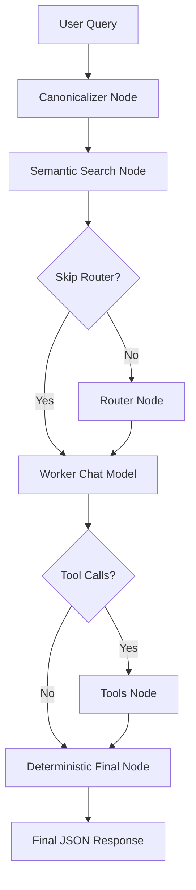

# CHAPTER1-ASSIST

CHAPTER1-ASSIST is an AI-powered ERP/accounting assistant built with FastAPI, LangGraph, LangChain, Ollama, and ChromaDB.

It allows users to ask natural-language ERP queries and receive structured answers by selecting the right business tool, calling ERP APIs, filtering records, projecting only relevant fields, and returning a deterministic JSON response.

The assistant supports queries related to:

- Sales invoices
- Purchase invoices
- Customer and vendor bills
- Product and inventory details
- HSN, GST, SKU, and stock quantity
- Outstanding amount and invoice status
- Multi-intent ERP queries
- English, Hindi, Hinglish, Gujarati, and mixed-language queries

---

## Project Status

This project is currently a working prototype.

It is designed for learning, experimentation, portfolio use, and ERP assistant architecture testing.

Current strengths:

- Simple sales, purchase, and product queries work well
- Multi-tool queries are supported
- Hinglish and Gujarati-style ERP queries are supported
- Partial success and no-record cases are handled
- Final answers are generated deterministically using Python instead of relying on a second LLM response
- LangSmith tracing can be used to inspect graph latency and flow

Known limitations:

- Mathematical aggregation such as total, count, average, minimum, and maximum is planned but not fully implemented yet
- Same-tool multi-intent queries may need additional handling in advanced cases
- True "all records" behavior depends on API pagination and configured limits
- This is not production-ready yet

---

## Features

- FastAPI backend with `/chat` endpoint
- LangGraph workflow for structured agent execution
- Canonicalizer node for multilingual query normalization
- Metadata-based tool selection for faster routing
- ChromaDB vector search fallback
- Router node fallback for uncertain tool selection
- Worker LLM for tool-calling only
- ERP API tools for sales, purchase, and product data
- Dynamic filters and field projection
- Deterministic final JSON response
- Step timing logs for latency debugging
- LangSmith tracing support
- Local Ollama model support

---

## Tech Stack

| Layer | Technology |
|---|---|
| Backend API | FastAPI |
| Agent Framework | LangGraph |
| LLM Orchestration | LangChain |
| Local LLM Runtime | Ollama |
| Vector Store | ChromaDB |
| Embeddings | Ollama Embeddings |
| Observability | LangSmith |
| Data Source | Chapter1 ERP APIs |
| Language | Python |

---

## Architecture



---

## How It Works

### 1. Canonicalizer Node

The canonicalizer converts multilingual ERP queries into canonical English.

Example:

```text
A/0326/C0077 sales bill ka customer name, amount aur status batao
```

Canonical form:

```text
Show customer name, net amount and status for sales invoice A/0326/C0077
```

It also detects document type:

- `sales_invoice`
- `purchase_invoice`
- `product`
- `mixed`
- `unknown_invoice`
- `unknown`

---

### 2. Semantic Search and Tool Selection

The semantic search node selects tools using:

1. Tool metadata and aliases
2. Query-part splitting for multi-intent queries
3. ChromaDB vector search fallback
4. Router node fallback when needed

Supported tools:

| Tool | Purpose |
|---|---|
| `get_sales_list` | Fetch sales invoice and customer bill data |
| `get_purchase_list` | Fetch purchase invoice and vendor bill data |
| `get_product_list` | Fetch product, inventory, stock, HSN, SKU, and GST data |

---

### 3. Worker LLM

The worker model does not produce the final response directly.

Its job is to call the correct tools with arguments such as:

- `term`
- `filters`
- `fields`
- `page`
- `limit`
- `from_date`
- `to_date`

This keeps the LLM responsible for planning, while Python handles the final response.

---

### 4. ERP API Tools

The tools call Chapter1 ERP API endpoints for:

- Sales data
- Purchase data
- Product and inventory data

Each tool supports:

- Search term
- Filters
- Field projection
- Pagination
- Date range filters
- Numeric comparisons where supported

Example filter:

```json
{
  "invoiceNo": "PR-31"
}
```

Example numeric filter:

```json
{
  "closingQty": {
    "lt": 0
  }
}
```

---

### 5. Deterministic Final Response

The final response is built using Python logic instead of a second LLM call.

This improves:

- Accuracy
- Consistency
- Debugging
- Reduced hallucination risk
- Reliable JSON output

---

## Folder Structure

```text
CHAPTER1-ASSIST/
│
├── fast_main.py
├── main.py
├── requirements.txt
├── models.txt
├── README.md
│
├── src/
│   ├── api_client.py
│   ├── config.py
│   ├── dummy.py
│   ├── graph.py
│   ├── nodes.py
│   ├── retriever.py
│   ├── schema.py
│   ├── tool_doc.py
│   ├── tools.py
│   ├── tools_api.py
│   └── vector_store.py
│
└── chroma_db/
```

Note: `chroma_db/` is generated locally and should usually be ignored in Git unless you intentionally want to version your vector store.

---

## Installation

### 1. Clone the Repository

```bash
git clone https://github.com/<your-username>/CHAPTER1-ASSIST.git
cd CHAPTER1-ASSIST
```

### 2. Create a Virtual Environment

Linux/macOS:

```bash
python3 -m venv venv
source venv/bin/activate
```

Windows:

```bash
python -m venv venv
venv\Scripts\activate
```

### 3. Install Dependencies

```bash
pip install -r requirements.txt
```

---

## Ollama Setup

Install Ollama from the official website:

```text
https://ollama.com
```

Pull the required models:

```bash
ollama pull granite4.1:8b
ollama pull bge-m3
```

Optional router/testing model:

```bash
ollama pull phi4-mini
```

Current recommended usage:

| Model | Purpose |
|---|---|
| `granite4.1:8b` | Canonicalizer and worker LLM |
| `bge-m3` | Embedding model |
| `phi4-mini` | Optional router/testing model |

---

## Environment Variables

Create a `.env` file in the project root.

```env
CHP1_API_BASE_URL=https://your-chapter1-api-base-url/
CHP1_API_TOKEN=your_api_token_here
CHP1_API_TIMEOUT=30
COMPANY_ID=your_company_id

LANGSMITH_TRACING=true
LANGSMITH_API_KEY=your_langsmith_api_key_here
LANGSMITH_ENDPOINT=https://api.smith.langchain.com
LANGSMITH_PROJECT=CHAPTER1-ASSIST-LATENCY
```

Do not commit real API tokens, company IDs, or LangSmith keys to GitHub.

---

## Recommended `.gitignore`

Create a `.gitignore` file with:

```gitignore
# Python
__pycache__/
*.pyc
*.pyo
*.pyd

# Virtual environment
venv/
.env

# Local databases / vector stores
chroma_db/

# Logs
*.log

# OS/editor files
.DS_Store
.vscode/
.idea/

# Jupyter
.ipynb_checkpoints/
```

---

## Build the Vector Store

Before running the app for the first time, build the Chroma vector store:

```bash
python src/vector_store.py
```

This stores tool documents inside `chroma_db/`.

---

## Run the FastAPI Server

Using Python:

```bash
python fast_main.py
```

Or using Uvicorn:

```bash
uvicorn fast_main:app --reload
```

The API runs at:

```text
http://127.0.0.1:8000
```

---

## API Endpoints

### Health Check

```http
GET /
```

Example response:

```json
{
  "message": "ERP Assistant API is running"
}
```

---

### Chat Endpoint

```http
POST /chat
```

Request body:

```json
{
  "query": "Show customer name, amount and status for sales invoice A/0326/C0077"
}
```

Example cURL:

```bash
curl -X POST "http://127.0.0.1:8000/chat" \
  -H "Content-Type: application/json" \
  -d '{"query":"A/0326/C0077 sales bill ka customer amount aur status bata"}'
```

Example response shape:

```json
{
  "response": {
    "success": true,
    "status": "success",
    "query": "A/0326/C0077 sales bill ka customer amount aur status bata",
    "tools_used": ["get_sales_list"],
    "data": {
      "get_sales_list": [
        {
          "invoiceNo": "A/0326/C0077",
          "billToName": "B2CMAHARASHTRA",
          "netAmount": "883",
          "status": "New"
        }
      ]
    },
    "summary": "get_sales_list: found 1 record",
    "errors": []
  },
  "timings": [
    {
      "node": "canonicalizer",
      "duration_sec": 1.234
    }
  ],
  "total_time_sec": 5.678
}
```

---

## Example Queries

### Sales Invoice

```text
A/0326/C0077 sales bill ka customer name, amount aur status batao
```

### Purchase Invoice

```text
PR-31 purchase bill ka vendor name aur net amount dikhao
```

### Product / HSN / Stock

```text
HSN 48211090 ke products dikhao jinka closing quantity 0 se kam hai
```

### Multi-Intent Query

```text
A/0326/C0077 bill ka customer amount bata, PR-31 purchase bill ka vendor amount dikha, aur 48211090 HSN me negative stock wala item bata
```

### Customer List

```text
jo jo customers ko hamne sell kia hai un sabke name chahiye
```

### Vendor List

```text
jinse bhi hamne kharidi ki hai un sabka name chahiye
```

### Product List

```text
hamare sare goods ka list chahiye
```

---

## Response Status Values

| Status | Meaning |
|---|---|
| `success` | Data found successfully |
| `partial_success` | Some requested data was found and some was not |
| `no_matching_records` | Tools ran but no matching records were found |
| `error` | Tool or API error occurred |
| `graph_timeout` | Graph execution exceeded timeout |
| `graph_error` | Unexpected graph-level error |
| `no_tool_call` | Worker LLM returned text instead of tool calls |
| `invalid_final_json` | Final response could not be parsed as JSON |

---

## LangSmith Tracing

This project can be traced using LangSmith.

Add the following to `.env`:

```env
LANGSMITH_TRACING=true
LANGSMITH_API_KEY=your_langsmith_api_key_here
LANGSMITH_ENDPOINT=https://api.smith.langchain.com
LANGSMITH_PROJECT=CHAPTER1-ASSIST-LATENCY
```

Then run the server and send requests using Postman.

LangSmith can help inspect:

- Full graph flow
- Node latency
- LLM prompts and outputs
- Tool calls
- Tool arguments
- API latency
- Final response state

Useful trace checks:

```text
canonicalizer -> semantic_search -> chat_model -> tools -> deterministic_final
```

For fallback cases:

```text
canonicalizer -> semantic_search -> router -> chat_model -> tools -> deterministic_final
```

---

## Development Notes

### Why Deterministic Final Output?

LLMs are useful for understanding intent and deciding tool calls, but ERP responses must be accurate.

This project uses:

```text
LLM = planning and tool-calling
Python = final data merging and JSON response
```

This reduces hallucinations and makes output easier to debug.

---

### Why Canonicalization?

Users often ask ERP queries in mixed language:

```text
sales bill ka customer amount bata
```

The canonicalizer converts it to:

```text
Show customer name and net amount for sales invoice
```

This improves tool selection and tool argument generation.

---

### Why Metadata + Vector Search?

Pure vector search can miss multi-tool queries.

This project combines:

- Tool metadata
- Alias matching
- Query splitting
- Vector search fallback
- Router fallback

This improves multi-intent query handling.

---

## Limitations

Current known limitations:

- Math operations such as total, count, average, minimum, and maximum need additional deterministic aggregation logic
- Same-tool multi-intent queries may require improved per-tool-call result tracking
- True "all records" behavior depends on API pagination
- Complex date range support depends on tool/API support
- This project is a prototype and is not production-ready yet

---

## Roadmap

- Add deterministic aggregation for total, count, average, minimum, and maximum
- Improve same-tool multi-intent result preservation
- Add better pagination support for "all records" queries
- Add stricter field projection repair
- Add authentication for API users
- Add structured logging
- Add retry logic for unstable APIs
- Add Docker support
- Add automated tests for routing and final JSON generation
- Add conversation memory and checkpointing
- Add text-format response mode for user-facing output

---

## Security Notes

Before pushing to GitHub:

- Remove hardcoded API tokens from source code
- Use environment variables for secrets
- Add `.env` to `.gitignore`
- Do not commit `venv/`
- Do not commit `__pycache__/`
- Do not commit local Chroma database files unless intentionally required
- Avoid exposing private API URLs in public repositories

---

## Author

Built by Yash Sheth as an AI-powered ERP assistant prototype.

---

## License

This project is for learning, experimentation, and portfolio use.

Add a license file before using it in production or distributing it publicly.
